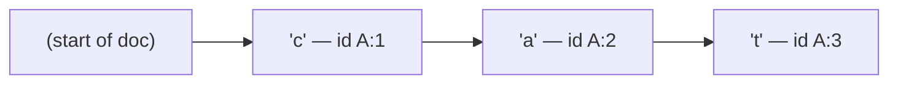
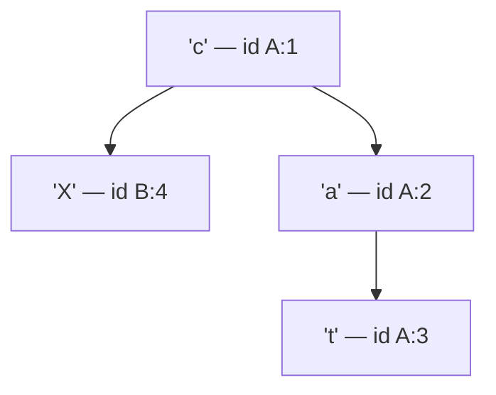
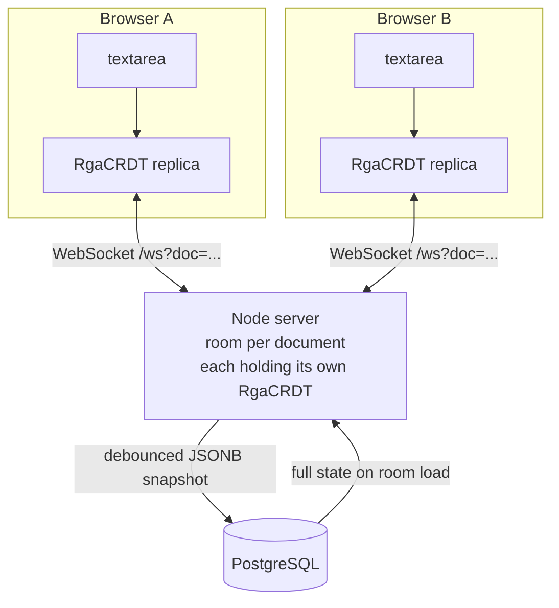

# CollabPad — Full Project Explanation

A study guide for explaining this project in an interview. Written in plain language,
building from "what problem does this solve" up to the subtle parts an interviewer will
push on.

**Status: the project is complete and matches your resume.** All four resume bullets are
now accurate — see section 13 for the line-by-line check, including one nuance about
"zero data loss" you should be ready for.

---

## 1. What the project is, in one paragraph

CollabPad is a shared text box on a web page. Several people open the same document at
the same time, everyone types, and everyone sees everyone else's typing appear live —
like Google Docs, but plain text only. The hard part, and the entire point of the
project, is making sure that when two people type at the exact same moment, nobody's
work gets lost and everyone ends up looking at the identical document.

That guarantee is provided by a **CRDT** that I implemented from scratch rather than
pulling in a library.

---

## 2. Why this is actually hard

The naive approaches both break. It's worth being able to explain *why*, because that's
usually the first question.

### Naive attempt 1: send the whole document

Every time someone types, send the full text to everyone else.

Two people type at once → the two messages cross in flight → whoever's message arrives
last overwrites the other. One person watches their sentence vanish as they type it.
This is "last write wins", and it loses data.

### Naive attempt 2: send positions — "insert 'X' at index 5"

This seems obviously right and is obviously wrong. Positions are not stable, because
other people's edits shift them.

Concrete example. Both users start with `abc`:

| | User A | User B |
|---|---|---|
| Types | `X` at index 1 | `Y` at index 2 |
| Sees locally | `aXbc` | `abYc` |

Now the messages cross:

- A receives *"insert Y at index 2"* and applies it to `aXbc` → **`aXYbc`**
- B receives *"insert X at index 1"* and applies it to `abYc` → **`aXbYc`**

The two users now have permanently different documents, and it will never heal. This is
called **divergence**, and avoiding it is the whole game.

The root cause: **index 2 meant something different to each user.** An index is a
statement about a document that has already changed.

---

## 3. The two known solutions, and why I picked CRDT

### Operational Transformation (OT)

What Google Docs uses. Keep sending positions, but when an op arrives, *transform* it
against every op you already applied, adjusting its index. In the example above, B's
"insert Y at 2" would be transformed into "insert Y at 3" before A applies it.

- Needs a central server to put all operations into one authoritative order.
- The transform functions are famously difficult — there are published papers correcting
  bugs in earlier published papers.

### CRDT — Conflict-free Replicated Data Type

Stop using positions entirely. **Give every single character a permanent, globally
unique ID.** Operations refer to IDs, never to positions. Positions shift constantly;
an ID never changes.

- No central arbiter needed — any replica can merge any op in any order.
- The merge rule is fixed and simple, so it's much easier to prove correct.
- Cost: extra metadata per character, and deleted characters have to be kept around
  (see tombstones, section 7).

**The one-line answer:** *"OT rewrites the operation to fit the document. A CRDT writes
the operation so it never needs rewriting."*

---

## 4. RGA — the specific CRDT I implemented

RGA stands for **Replicated Growable Array**. Three ideas:

### Idea 1 — every character gets a permanent ID

```ts
interface CharId {
  site: string;    // which replica created it ("site-a7f3")
  counter: number; // a logical clock value (see section 6)
}
```

`site` makes it unique across users; `counter` makes it unique within a user.

### Idea 2 — every character remembers what it was typed *after*

```ts
interface Char {
  id: CharId;
  value: string;           // one character
  visible: boolean;        // false = deleted
  originId: CharId | null; // the character this was typed after; null = start of doc
}
```

That `originId` is the key. Instead of *"I go at index 5"*, a character says
**"I go immediately after that specific character"** — and that stays true no matter
what anyone else does.

### Idea 3 — the document is secretly a tree

Because each character points at its parent, the whole document forms a tree. The text
you actually see is produced by walking that tree in a specific order.

Typing `cat` on replica A produces a simple chain:



Now replica B, which also has `cat`, types `X` between `c` and `a`. B's `X` says
*"my origin is c (A:1)"*. But `a` **also** says its origin is `c`. They are now
**siblings** — two characters claiming the same parent:



Which sibling comes first? A fixed tie-break rule that every replica applies identically:
**higher counter wins, ties broken by site id.** `X` has counter 4, `a` has counter 2, so
`X` goes first. Result: `cXat`, on every replica, regardless of what order the messages
arrived in.

That tie-break is `compareIds()` in the code:

```ts
export function compareIds(a: CharId, b: CharId): number {
  if (a.counter !== b.counter) return a.counter - b.counter;
  if (a.site === b.site) return 0;
  return a.site < b.site ? -1 : 1;
}
```

> **Careful — a trap in the original spec.** The spec said `getText()` should "render
> visible chars in id order". That is wrong and produces garbage. The document order
> comes from the **origin relationships**; `compareIds` is used *only* to order siblings
> that share a parent. Sorting all characters globally by ID is a completely different
> (and broken) algorithm. If asked "how do you produce the text", the answer is
> "a depth-first walk of the origin tree", not "sort by ID".

---

## 5. The insertion algorithm (`integrate()`)

This is the heart of the project — about 30 lines in
[`RgaCRDT.ts`](server/src/crdt/RgaCRDT.ts). In practice the tree is stored flattened
into one array in display order, and inserting means finding the right slot:

1. **Already seen this ID? Stop.** This makes the operation *idempotent* — receiving the
   same op twice does nothing. Important, because it means duplicate network messages are
   harmless.
2. **Find the origin character in the array.** If it isn't there yet (its message hasn't
   arrived), **park this op** in a pending map and replay it when the origin shows up.
3. **Start at the position just after the origin.**
4. **Walk right, skipping every character whose ID is bigger than mine.** Stop at the
   first character whose ID is smaller.
5. **Insert there.**

Step 4 is the part worth understanding. It's what orders siblings newest-first, and it's
also what keeps you from landing inside somebody else's subtree — see the next section.

```ts
while (i < this.chars.length && compareIds(this.chars[i]!.id, op.id) > 0) {
  i += 1;
}
```

---

## 6. The Lamport clock — the subtlest part, and the best thing to talk about

If the interviewer wants depth, this is where you go. It shows you understood the
algorithm rather than transcribing it.

### What `counter` actually is

`counter` is **not** "how many characters I have typed". It's a **Lamport logical
clock**:

- When I type a character: `clock = clock + 1`
- When I receive *any* op from anyone: `clock = max(clock, theirCounter)`

That second line is one line of code and is the entire subject of this section.

```ts
applyRemote(op: Op): void {
  if (op.kind === 'insert') {
    if (op.id.counter > this.clock) this.clock = op.id.counter;  // <-- this line
    this.integrate(op);
  } else {
    this.integrateDelete(op.id);
  }
}
```

### What it buys you

It guarantees one invariant: **a character's ID is always greater than its origin's ID.**

Why does that matter? Go back to step 4 of the algorithm — "skip every character whose ID
is bigger than mine". Because every character's ID is bigger than its parent's, skipping
a character means you *automatically* skip all of its children, grandchildren, and so on.
So you can never accidentally land between a character and its own descendants — you
either skip a whole subtree or you don't enter it at all.

Break that invariant and the skip rule starts slicing through the middle of other
people's subtrees.

### What actually breaks without it — and this is the interesting bit

The intuitive answer is "replicas diverge". **That answer is wrong**, and I verified it
by deliberately deleting the clock-merge line and re-running the tests.

Without the clock merge, **the replicas still converge** — they still agree with each
other perfectly. What breaks is something different, called **intention preservation**:
characters stop landing where the user actually typed them.

The concrete failure I measured: a user whose clock is stale (they've been reading
without typing, so their counter is still low) types `Y` at position 1 of `ac`. Their
character gets a very low ID, which means the skip rule skips almost the entire document,
and the character lands at the very end. Both replicas showed `"aXcY"` — in complete
agreement, on a document nobody typed.

**So the precise statement is:**

| Property | What it means | What guarantees it |
|---|---|---|
| **Convergence** | Everyone ends up with the same document | The merge rule being deterministic — any consistent tie-break works |
| **Intention preservation** | Your character lands where you typed it | The Lamport clock |

Being able to draw that distinction is a genuinely strong interview moment. Most people
who have read a CRDT tutorial cannot.

There is a regression test for exactly this, which fails on a single replica with no
networking involved:

```ts
it("keeps a lagging replica's edit where it was typed, not at the end", () => {
  const a = new RgaCRDT('site-a');
  const b = new RgaCRDT('site-b');

  deliver(b, typeText(a, 'abcdefghij', 0));  // b receives, never types — clock still 0

  typeText(b, 'Z', 5);
  expect(b.getText()).toBe('abcdeZfghij');   // without the clock merge: 'abcdefghijZ'
});
```

The same invariant matters again when loading from the database — see section 11.

---

## 7. Tombstones — why deleted text is never actually deleted

When you delete a character, the code does **not** remove it from the array. It flips a
flag:

```ts
char.visible = false;
```

### Why

Because someone else, right now, might be typing a character whose origin is the one
you just deleted. If the character were truly gone, their op would arrive with nothing to
anchor to, and there'd be no correct place to put it. The tombstone keeps the anchor
point alive.

It also makes deletes naturally **idempotent** — setting `visible = false` twice is the
same as doing it once.

### The cost — say this before they ask

The document array only ever grows. Type 10,000 characters and delete all of them, and
the CRDT still holds 10,000 entries — and all of them get written to Postgres in every
snapshot. Real production CRDTs solve this with garbage collection once all replicas have
provably seen a delete; this project does not, and documents it as a known limitation.
Naming a limitation before being asked reads as competence.

---

## 8. Handling messages arriving in the wrong order

The CRDT never assumes ordered delivery. Two cases, two small buffers:

| Situation | Handling |
|---|---|
| A **delete** arrives before the character it deletes | Remember the ID in `pendingDeletes`. When the insert finally arrives, it's marked invisible immediately on arrival. |
| An **insert** arrives before its origin | Park it in `pendingInserts`, keyed by the origin it's waiting for. When that origin arrives, the parked op is replayed (recursively — parked ops can unblock other parked ops). |

This is why the project can claim *"converges regardless of delivery order"*. There's a
`pendingCount` getter used by tests to assert that everything drained and nothing got
stuck.

---

## 9. How the whole system fits together



**Every participant runs the same CRDT** — both browsers *and* the server. The server is
not a referee; it's just another replica that also happens to relay messages and save
snapshots.

### One keystroke, end to end

1. You press `k`. The browser's `input` event fires.
2. The client diffs the textarea's previous value against its new value and works out
   what changed (section 10).
3. It calls `crdt.insert('k', originId)` **locally and immediately** — so your own typing
   never waits for the network. This is the "optimistic local application" on your resume.
4. That returns an op: `{kind:'insert', id:{site:'site-a7f3',counter:12}, value:'k', originId:{...}}`.
5. The op goes over the WebSocket as JSON.
6. The server validates it, finds the room for that document, applies the op to the
   room's own CRDT, and **rebroadcasts it byte-for-byte unchanged** to every other client
   in that room. The server never rewrites an op — that's the difference from OT.
7. Each other browser calls `applyRemote(op)`, which merges it, and re-renders the
   textarea.
8. The room is marked dirty, and a snapshot is scheduled (section 11).

### The rooms

The server keeps `Map<docId, Room>` where a `Room` is `{ crdt, clients }`. A room is
created on first join, loaded from Postgres, and dropped from memory once empty.
Documents are fully isolated — there's a test asserting edits in one never leak into
another.

One detail worth mentioning: the map stores **promises** of rooms, not rooms. Two people
opening the same document simultaneously would otherwise both miss the cache, both start
loading it from the database, and the second would silently replace the first —
disconnecting them. Caching the in-flight promise means concurrent joins all wait on the
same load.

---

## 10. The client side — two problems the spec called hard

### Problem A: turning a textarea into operations

A `<textarea>` doesn't tell you *what* changed, only that something did. You get the new
string and have to work out the difference.

The spec suggested assuming single-character edits and treating paste as a special case.
I did something simpler that needs no special case: **strip the common prefix and the
common suffix**, and whatever's left in the middle is the change.

```
prev:  "hello world"
next:  "hello there"
        ^^^^^^        common prefix (6)
                      common suffix (0)
→ removed "world", inserted "there", at position 6
```

Typing, backspace, paste, cut, and select-then-replace all come out of that one function
as a single `{removed, inserted}` pair. It then emits one delete op per removed character
and one insert op per inserted character.

One ordering subtlety in the code: **all the doomed character IDs are looked up before
any deletion happens**, because each delete shifts the positions of everything after it.

### Problem B: the cursor jumping around

If someone else types at the top of the document while your cursor is in the middle,
naively setting `textarea.value` throws your cursor to the end. This is the single thing
that makes a collaborative editor feel broken.

The fix: **anchor the cursor to a character's identity, not to a number.** Before applying
a remote op, record the `CharId` of the character immediately before the cursor. After
applying it, look up where that character is *now* and put the cursor just after it. If
someone deleted that character, fall back to the old numeric offset.

There is a real browser test for this — two Chrome tabs, cursor placed after `wor` in
`world`, the other tab inserts `hello ` at the very start, and the cursor must end up at
offset 9 rather than the stale 3 or the end.

### A smaller detail: code points vs UTF-16

JavaScript strings are UTF-16, so an emoji like 😀 is **two** units long. One CRDT
character holds one *code point*, so all the client math iterates with `[...string]`
rather than by index — otherwise a remote insert could land between the two halves of an
emoji and corrupt it.

---

## 11. Persistence — the Postgres layer

This is your third resume bullet, so be ready to talk about it.

### The table

One table. The whole document is a single JSONB column.

```sql
CREATE TABLE IF NOT EXISTS documents (
  id         UUID PRIMARY KEY DEFAULT gen_random_uuid(),
  title      TEXT NOT NULL DEFAULT 'Untitled',
  chars      JSONB NOT NULL DEFAULT '[]'::jsonb,
  created_at TIMESTAMPTZ NOT NULL DEFAULT now(),
  updated_at TIMESTAMPTZ NOT NULL DEFAULT now()
);
```

**Why JSONB rather than a row per character?** A normalized `characters` table would mean
thousands of rows per document, and the application never queries *into* the array — it
reads the whole thing on load and writes the whole thing on save. JSONB stores it parsed
(not as text), so it round-trips into real JavaScript objects with no `JSON.parse` on our
side, and leaves the door open to querying inside it later.

**Why snapshots rather than an append-only operation log?** An op log grows without bound
and makes loading a document O(number of edits ever made). A snapshot makes loading
O(document size). The original spec listed an `op_log` table as an optional stretch goal;
it was cut deliberately — it would have added a table, a write on every keystroke, and no
user-visible benefit.

Raw SQL through `pg`, no ORM — the queries are simple enough that an ORM would only hide
them.

### The debounce, and the ceiling on it

Writing to Postgres on every keystroke would hammer the database for no reason. So saves
are **debounced by 2 seconds of inactivity**.

But a pure debounce has a nasty failure mode worth volunteering in an interview:
**someone typing steadily resets the timer on every keystroke, so the snapshot never gets
written at all.** A ten-minute writing session could be entirely unsaved.

So there's also a **max-wait ceiling of 10 seconds** — however much you keep typing, a
snapshot lands at least every 10 seconds. There's a test that types continuously and
asserts a save still happens.

### Loading, and the Lamport clock again

When a room is created, it loads the stored array and rebuilds a replica directly with
`RgaCRDT.fromChars()` — **not** by replaying operations. The array is already in document
order, so this is O(n) rather than O(n²).

One easy-to-miss detail: `fromChars` must also **restore the Lamport clock** to the
highest counter in the snapshot. Miss that and a reloaded replica starts at zero and its
very first edit gets misplaced, exactly as in section 6. There's a test for it.

### "Zero data loss across restarts" — know the nuance

Two things make this true:

1. The debounced snapshot, capped as above.
2. A **SIGTERM handler that flushes every dirty room before the process exits.** This is
   the important one — Render sends SIGTERM before replacing a container on deploy, so a
   normal restart writes everything out first and loses nothing.

**The honest nuance, in case you're pushed:** a *graceful* restart loses nothing. A hard
crash — `kill -9`, power loss, OOM — can lose up to the debounce window, so a couple of
seconds of typing. The fix would be the op log, trading write volume for durability.
Saying this yourself is much stronger than being caught by it.

### Guarding the ID

Document IDs are UUIDs. Postgres raises an error on a malformed UUID, so
`/api/documents/banana` would be a 500 rather than a 400. Every ID is validated against a
UUID pattern before it reaches SQL — in the REST routes *and* on WebSocket join, which
also stops anyone creating unlimited in-memory rooms with junk IDs.

---

## 12. The technologies, and why each one

| Technology | What it is | Why it's here |
|---|---|---|
| **Node.js** | JavaScript runtime outside the browser | The CRDT can then be *the exact same file* on client and server. In another language you'd write and maintain it twice, and any difference between the two versions is a divergence bug. |
| **TypeScript** | JavaScript with static types | `CharId`, `Char`, `Op` are precise shapes. `Op` is a discriminated union, so `if (op.kind === 'insert')` makes `op.value` available and a `delete` op with a `.value` won't compile. Very valuable where a wrong field is a silent data-corruption bug. |
| **WebSocket** | A two-way connection that stays open | HTTP is request/response — the server can't speak first. Collaboration needs the server to *push* other people's keystrokes to you the moment they happen. Polling would mean either high latency or hammering the server. |
| **`ws` library** | A minimal WebSocket implementation | Chosen over `socket.io` deliberately. socket.io adds rooms, reconnection and fallbacks — exactly the machinery this project exists to demonstrate. `ws` keeps the protocol visible. |
| **Express** | HTTP server framework | Serves the static files and two REST routes. Minimal on purpose. |
| **PostgreSQL** | Relational database | Durable storage for document snapshots. Chosen with `pg` and raw SQL rather than an ORM — the queries are a handful of statements and an ORM would only obscure them. |
| **JSONB** | Postgres binary JSON column type | Stores the character array parsed rather than as text, so it comes back as real objects and could be queried into later. |
| **Vitest** | Test runner | Fast, TypeScript out of the box. The convergence tests are the actual deliverable, not an afterthought. |
| **Vanilla JS, no bundler** | Plain HTML/CSS/JS | No React, no frontend build tooling. Keeps all attention on the CRDT and sync logic. |
| **`puppeteer-core`** | Drives a real Chrome | Test-only. Runs two genuine browser tabs against a real server to prove the thing works end to end, including cursor behaviour. Uses the system Chrome, so nothing is downloaded. |
| **`embedded-postgres`** | Runs a real Postgres binary | Test-only. Means the database tests run against genuine PostgreSQL rather than an emulator, so the SQL under test is the SQL that ships. Also lets the project be cloned and run with no database installed. |

### The dual-compile trick — worth mentioning if they ask about build setup

The CRDT is written once in TypeScript and compiled **twice**:

- `tsconfig.json` → CommonJS, for the Node server
- `tsconfig.client.json` → browser ESM in `public/crdt/`, loaded by `<script type="module">`

`types.ts` deliberately contains *only* types and is imported with `import type`, so
TypeScript erases the import entirely and the emitted `RgaCRDT.js` has **zero import
statements** — meaning it loads straight into a browser with no bundler and no import
map. One source of truth, two targets, no webpack.

---

## 13. Your resume, checked line by line

| Resume claim | Status |
|---|---|
| Hand-rolled RGA CRDT in Node.js and TypeScript, convergence without a central conflict arbiter | ✅ **Accurate.** The server relays but never transforms or reorders ops. |
| WebSocket sync layer, multiple document rooms, optimistic local application, idempotent remote merge | ✅ **Accurate.** All four, with tests for room isolation and idempotency. |
| Postgres persistence, debounced JSONB snapshots, full-state sync for late joiners, zero data loss across restarts | ✅ **Accurate**, with the graceful-vs-hard-crash nuance in section 11. |
| Property-based convergence tests, out-of-order and concurrent ops, multiple replicas, identical final state | ✅ **Accurate.** This is the strongest part — see section 15. |

Two things to have ready in case you're pushed:

- **"Zero data loss" means graceful restarts.** A `kill -9` can lose a few seconds. Say
  it yourself (section 11).
- **The date range says Apr–Jul 2026.** Make sure you can talk about it as finished work.

---

## 14. What is actually built

**Everything in the spec through Phase 6, plus the stretch presence indicator:**

- The RGA CRDT, with the Lamport-clock correction and out-of-order buffering
- WebSocket server: join, op routing, verbatim rebroadcast, room-per-document isolation,
  message validation, heartbeat to detect dead connections
- Postgres persistence: debounced JSONB snapshots with a max-wait ceiling, load on room
  creation, flush when a room empties, flush on SIGTERM
- REST API: list documents, create a document, fetch one
- Frontend: document list page, editor with textarea diffing, cursor preservation,
  auto-reconnect with exponential backoff, read-only until synced, presence indicator
- **53 tests, all passing**

**Deliberately not built** (all listed in the README as known limitations): tombstone
garbage collection, offline editing with an op queue, authentication, the optional
`op_log` table, and multi-server scale-out.

---

## 15. The testing story — a real strength, use it

53 tests across five layers:

| File | What it proves |
|---|---|
| `crdt.test.ts` | Convergence, idempotency, out-of-order delivery, the Lamport invariant |
| `editing.test.ts` | The textarea-diff path — that the CRDT always exactly reconstructs what the textarea holds |
| `ws.test.ts` | Real sockets: two clients converge, late joiners get full state, documents stay isolated, malformed input doesn't crash anything |
| `persistence.test.ts` | **Real PostgreSQL**: snapshots land as JSONB, restart durability, the REST API, join validation |
| `browser.test.ts` | Two real Chrome tabs: live sync, presence, cursor preservation, paste, and text surviving a reload |

### Property-based / fuzz testing — this is the resume bullet

Rather than only hand-writing scenarios, the tests **generate** them: three replicas make
random edits, ops are shuffled into random delivery orders per replica, and the test
asserts all three end up identical. A seeded random generator means any failure is
reproducible from its seed number.

One fuzz test deliberately makes the replicas **asymmetric** — one power typist, one
lurker. That matters: with equal edit volumes the replicas' clocks stay accidentally in
step, which hides exactly the class of bug (a stale clock) the test exists to find.

### Real databases and real browsers, not mocks

The persistence tests run an actual PostgreSQL binary, so genuine JSONB, real
`gen_random_uuid()`, real transaction semantics. The browser tests drive real Chrome. A
mocked database proves your mock works; this proves the SQL works.

### The concurrency test that was quietly lying

Worth telling, because it shows test judgement. The browser test for two tabs typing at
the same position originally typed into one tab and then the other. But the first tab's
edits arrived over the socket *before* the second tab started — so it was testing
sequential editing while claiming to test concurrency, and it would have passed even if
the merge logic were broken.

The fix: patch `WebSocket.send` inside each page to hold outbound ops in a buffer, type
into both tabs while they're isolated, assert each tab still sees only its own text, then
release both buffers at once. Now it genuinely tests a concurrent merge.

### Mutation testing — the best thing you can say about your tests

I checked that the tests actually *catch* bugs by deliberately breaking the code and
confirming they fail:

- **Removed the Lamport clock merge** → 4 tests failed. This is also how I discovered the
  failure mode is misplacement rather than divergence.
- **Disabled the RGA skip rule** → 4 tests failed, including both fuzz tests.

This is a strong thing to volunteer. Anyone can say "I wrote tests." Very few can say
"I verified my tests fail when the code is wrong."

---

## 16. Likely interview questions, with short answers

**"What's a CRDT?"**
A data structure designed so that replicas can be updated independently and merged in any
order, always ending up identical, without a central coordinator. "Conflict-free" means
the merge rule is defined for every possible pair of concurrent operations, so there's
never a conflict to resolve.

**"Why not just use Yjs / Automerge?"**
For production I would — they're mature and far more optimized. The point of this project
was to actually understand the algorithm rather than call it.

**"Why CRDT instead of OT?"**
OT needs a central server to totally order operations and needs correct transform
functions, which are notoriously hard. A CRDT pushes the difficulty into the data model
instead — give characters stable IDs and the merge becomes order-independent. It costs
metadata and tombstones and buys simplicity plus no required central arbiter.

**"How do you handle two people typing at the same position?"**
Both characters record the same origin, making them siblings. Every replica applies the
same tie-break — higher Lamport counter first, site ID to break exact ties — so all
replicas independently compute the same order. Neither character is lost; one simply
comes first.

**"What happens if a message is duplicated or arrives out of order?"**
Duplicates are no-ops — every op is checked against a map of known IDs before being
applied. Out-of-order ops are buffered: a delete for a character not yet seen is
remembered and applied on arrival; an insert whose origin hasn't arrived is parked keyed
on that origin and replayed when it does.

**"Why store the whole document as JSONB instead of a row per character?"**
The application never queries into the array — it loads the whole document and saves the
whole document. A row per character would mean thousands of rows and a much more
expensive load, for no benefit. JSONB keeps it as one parsed value.

**"Why snapshots instead of an event log?"**
Loading from an op log is O(every edit ever made) and grows forever; loading from a
snapshot is O(document size). An op log would give better crash durability, which is the
trade-off — I chose the simpler read path and documented the crash window.

**"How do you avoid hammering the database?"**
Saves are debounced two seconds. But a pure debounce never fires for someone typing
continuously, so there's also a ten-second max-wait ceiling, plus a flush when the last
client leaves a document and a flush on SIGTERM.

**"What are the downsides of your approach?"**
Honestly, several: tombstones mean the document only grows, with no garbage collection.
Per-character metadata makes storage much larger than the raw text. Finding a character
is a linear scan. And a hard crash can lose a few seconds of edits.

**"How would you scale this to many servers?"**
Right now rooms live in one process's memory, so all clients for a document must land on
the same server. The natural next step is sticky routing by document ID, or a pub/sub
layer such as Redis so servers relay ops to each other. The CRDT itself needs no changes
at all — that's rather the point of using one.

**"Why is the server there, if any replica can merge anything?"**
Only as a relay and a place to persist snapshots. It never transforms or reorders
operations. It also gives late joiners a full state snapshot so they don't have to replay
history from the beginning.

**"How does a new person joining midway get the document?"**
On join, the server sends a `state` message containing the full character array. The
client rebuilds its replica directly from that array rather than replaying every
operation. Its Lamport clock is set to the highest counter in the snapshot — otherwise it
would start at zero and immediately mint IDs that misplace its first edit.

---

## 17. Quick file map

| File | What's in it |
|---|---|
| [`server/src/crdt/types.ts`](server/src/crdt/types.ts) | `CharId`, `Char`, `Op`. Types only — deliberately no runtime code, which is what lets the browser build stay import-free. |
| [`server/src/crdt/RgaCRDT.ts`](server/src/crdt/RgaCRDT.ts) | **The project.** `insert`, `delete`, `applyRemote`, `getText`, `integrate`, `compareIds`, `fromChars`. |
| [`server/src/ws/server.ts`](server/src/ws/server.ts) | WebSocket connections, join/op handling, heartbeat. |
| [`server/src/ws/rooms.ts`](server/src/ws/rooms.ts) | `Map<docId, Room>`, room lifecycle, broadcast. |
| [`server/src/ws/protocol.ts`](server/src/ws/protocol.ts) | Validates every incoming message. Rebuilds objects rather than forwarding them, so no attacker-supplied fields ride along into the database. |
| [`server/src/db/schema.sql`](server/src/db/schema.sql) | The `documents` table. Applied on every boot. |
| [`server/src/db/documents.ts`](server/src/db/documents.ts) | The SQL: list, create, fetch, load chars, save chars. Plus UUID validation. |
| [`server/src/db/persistence.ts`](server/src/db/persistence.ts) | Debounce, max-wait ceiling, flush-on-empty, flush-on-shutdown. |
| [`server/src/routes/documents.ts`](server/src/routes/documents.ts) | The REST endpoints. |
| [`public/app.js`](public/app.js) | Editor UI: connection, rendering, cursor preservation. |
| [`public/editing.js`](public/editing.js) | Textarea diffing → ops. Split out purely so it can be tested without a browser. |
| [`public/list.js`](public/list.js) | The document picker. |
| [`server/tests/`](server/tests/) | The five test layers described in section 15. |

---

## 18. The 60-second version, for "tell me about this project"

> CollabPad is a real-time collaborative text editor — several people edit the same
> document at once and everyone converges on the same result. The core of it is an RGA
> CRDT I implemented from scratch rather than using Yjs or Automerge.
>
> The problem it solves is that position-based edits break under concurrency — if I
> insert at index 1 while you insert at index 2, applying each other's operations
> naively gives us permanently different documents. RGA fixes that by giving every
> character a permanent unique ID and recording which character it was typed *after*, so
> operations never reference positions that can shift.
>
> Each browser and the server all run the same CRDT; the server just relays operations
> verbatim over WebSockets, keeps a room per document, and snapshots each document into
> Postgres as JSONB on a debounce.
>
> The part I found most interesting was the Lamport clock. I'd assumed that getting it
> wrong would cause replicas to diverge — but when I deliberately broke it to test my
> tests, the replicas still agreed perfectly. What actually broke was *intention
> preservation*: a user whose clock had fallen behind would type in the middle of the
> document and have their character land at the end. Everyone agreed on a document
> nobody had typed. That distinction between convergence and intention preservation
> wasn't obvious to me until I measured it.
